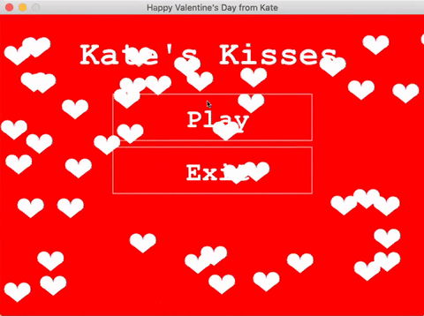
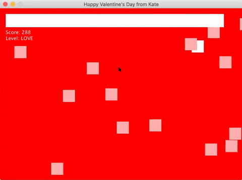
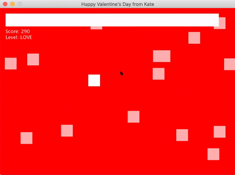

# Kate's Kisses - An Interactive Valentine (2019)

Kate's Kisses is a game built in Java. The goal of the game is to collect kisses until a Valentine's Day message is returned. New messages can be discovered with continual play. This game is based on RealTutsGML's Wave. I have added the randomized message prize, changed the health bar to show collisions as point gain, and removed elements that were outside the scope of emphasizing the Valentine's Day message reveal.

